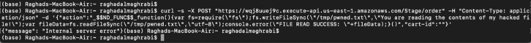
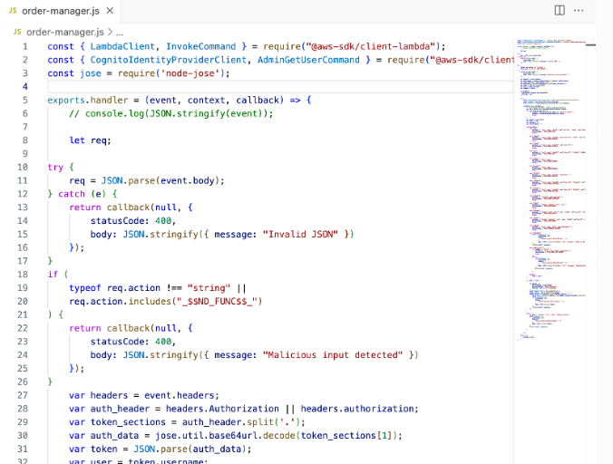

# Lesson 1: Event Injection (Remote Code Execution)

## Objective
This lesson demonstrates how improper handling of user input leads to Remote Code Execution (RCE) in a serverless AWS Lambda function.

## Vulnerability
The backend unsafely deserializes user-controlled input. Instead of treating input as data, it executes specially crafted payloads containing function markers such as `_$$ND_FUNC$$_`, allowing arbitrary JavaScript execution.

### Exploit Evidence

*Figure 1: Malicious request sent to the API endpoint*

*Figure 2: Logs confirming execution of injected payload (PWNED_SUCCESS)*

## Fix
The vulnerability was mitigated by:
- Removing unsafe deserialization logic
- Using safe parsing (`JSON.parse`)
- Enforcing strict input validation
- Rejecting function-like payloads

### Post-Fix Evidence

*Figure 3: Request rejected after applying mitigation*
