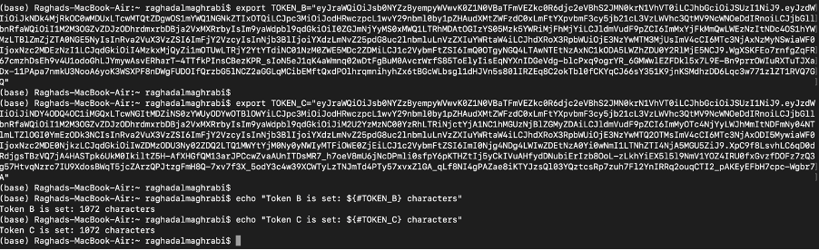
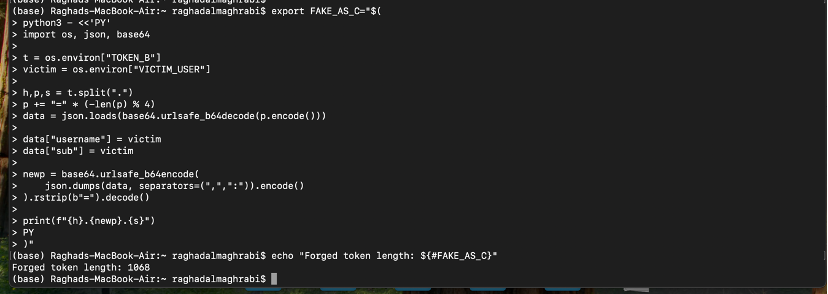
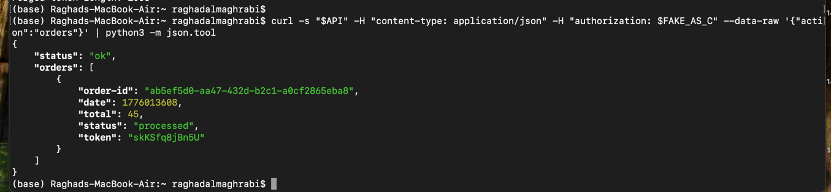
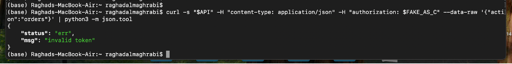

# Lesson 2: Broken Authentication (JWT Forgery)

## Objective
This lesson demonstrates how failure to verify JWT signatures results in authentication bypass.

## Vulnerability
The backend decodes JWT tokens but does not verify their cryptographic signature. This allows an attacker to modify identity fields such as `username` and impersonate another user.

### Exploit Evidence

*Figure 1: Legitimate JWT captured from request*

*Figure 2: Modified JWT used for impersonation*

*Figure 3: Accessing another user’s data using forged token*

## Fix
The issue was resolved by:
- Verifying JWT signatures using Cognito JWKS
- Validating claims such as issuer and expiration
- Rejecting all unverified tokens

### Post-Fix Evidence

*Figure 4: Forged token rejected after fix*
