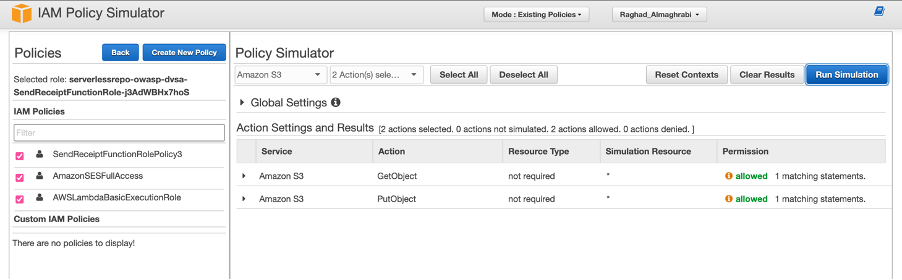
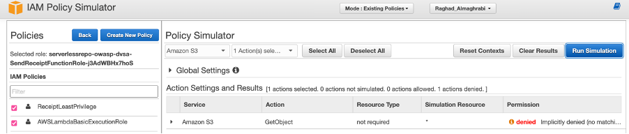

# Lesson 7: Over-Privileged Functions

## Objective
This lesson demonstrates how excessive IAM permissions allow unauthorized actions in AWS Lambda.

## Vulnerability
Lambda functions were assigned overly broad permissions, violating the principle of least privilege. This allowed attackers to invoke privileged functions and perform restricted operations.

### Exploit Evidence

*Figure 1: Execution of restricted operation*

## Fix
The vulnerability was mitigated by:
- Applying the principle of least privilege
- Restricting IAM roles and permissions
- Limiting Lambda invocation access

### Post-Fix Evidence

*Figure 2: Logs confirming secure behaviour after fix*
