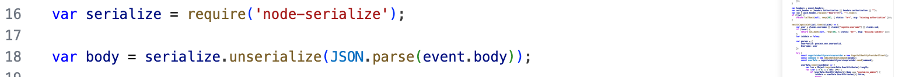
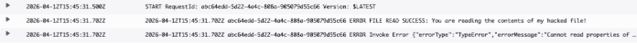
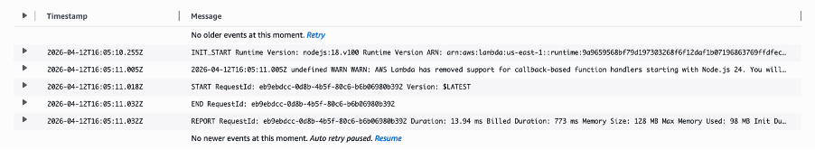

# Lesson 9: Vulnerable Dependencies

## Objective
This lesson demonstrates the risks associated with insecure third-party dependencies.

## Vulnerability
The application relies on outdated or vulnerable libraries that contain known security issues. These dependencies introduce exploitable weaknesses into the system.

### Evidence

*Figure 1: Vulnerability scan showing insecure dependencies*

*Figure 2: Demonstration of exploitation using vulnerable package*

## Fix
The issue was mitigated by:
- Updating all dependencies to secure versions
- Using tools such as npm audit and snyk
- Removing deprecated or vulnerable packages

### Post-Fix Evidence

*Figure 3: Secure dependency state after updates*
